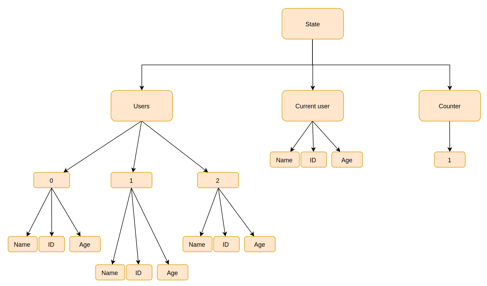

import { Head, Code, Appear, components as Components } from 'mdx-deck'
import { FullscreenCode, Split, SplitRight } from 'mdx-deck/layouts'
import { CodeSurfer } from 'mdx-deck-code-surfer'

import ImageWithLabel from './components/image-with-label'
export { default as theme } from './theme'

<Head>
  <title>Immutable data structures</title>
</Head>

# Immutable data structures

Author: Grzegorz Rozdzialik

---

## Agenda

1. Mutability vs immutability
2. Performance implications
3. _ImmutableJS_ - implementation of immutable data structures
4. Usage in the React ecosystem

---

## Mutability

---

<ImageWithLabel label="Mutability in jQuery land">
  
</ImageWithLabel>

---

## Mutating state

<div class="counter" style={{ fontSize: '2em' }}>
  <span class="counter__value">0</span>
  <button class="counter__increment" style={{ fontSize: '1em' }}>
    +
  </button>
</div>

```html
<div class="counter">
  <span class="counter__value">0</span>
  <button class="counter__increment">+</button>
</div>
```

---

<CodeSurfer
  steps={[{}, { lines: [5, 6], notes: 'Direct mutation of DOM nodes' }]}
  code={require('!raw-loader!./snippets/1-simple-mutation.js')}
/>

---

<CodeSurfer
  title="Extracted state"
  steps={[
    {},
    { lines: [1, 4], notes: 'Explicit state' },
    { lines: [6], notes: 'Independent update based on state' },
  ]}
  code={require('!raw-loader!./snippets/2-explicit-state.js')}
/>

---

<CodeSurfer
  title="Update function"
  steps={[
    {},
    { lines: [4], notes: 'Update state' },
    { lines: [6], range: [9, 11], notes: 'Function that updates the UI' },
    { notes: 'A familiar pattern, is it not?' },
  ]}
  code={require('!raw-loader!./snippets/3-updater-function.js')}
/>

---

<CodeSurfer
  title="More state - counter name"
  steps={[{}, { lines: [2], notes: 'Input for counter name' }]}
  code={require('!raw-loader!./snippets/4-counter-name.html')}
/>

---

<CodeSurfer
  title="Counter name handling in JS"
  steps={[
    {},
    { lines: [2], notes: 'Variable for the name' },
    {
      range: [10, 14],
      notes: 'onChange handler',
    },
    { lines: [18], notes: 'Update UI with the name' },
    {
      lines: [17, 18],
      notes: 'Independent update operations - could be split',
    },
  ]}
  code={require('!raw-loader!./snippets/4-counter-name.js')}
/>

---

<CodeSurfer
  title="Split update functions"
  steps={[{}, { range: [16, 27] }]}
  code={require('!raw-loader!./snippets/5-split-update-functions.js')}
/>

---

<CodeSurfer
  title="State object"
  steps={[
    {},
    { range: [1, 4] },
    { lines: [9, 15], notes: 'Pass state to update functions' },
    { range: [18, 29] },
  ]}
  code={require('!raw-loader!./snippets/6-state-object.js')}
/>

---

<CodeSurfer
  title="Simulate expensive updates"
  steps={[
    {},
    { range: [23, 29], notes: "Computing Fibonacci's numbers" },
    { range: [31, 34] },
    { lines: [32], notes: 'Now each update is expensive' },
  ]}
  code={require('!raw-loader!./snippets/7-expensive-computation.js')}
/>

---

## How to fix the problem?

1. Ignore update if `counterState.value` has not changed
2. Only call `updateCounterValue` when the value is actually changed

```notes
Preferred solution = 1
```

---

<CodeSurfer
  title="Compare states after update"
  steps={[
    {},
    { lines: [5], notes: 'Store previous state' },
    {
      range: [7, 25],
    },
    { ranges: [[8, 12], [18, 22]], notes: 'Update state' },
    { lines: [14, 24], notes: 'Pass previous state for comparison' },
    {
      range: [40, 55],
    },
    {
      ranges: [[41, 43], [50, 52]],
      notes: 'Ignore update if state did not change',
    },
  ]}
  code={require('!raw-loader!./snippets/8-compare-state.js')}
/>

---

<CodeSurfer
  title="Immutable updates in action"
  steps={[
    {},
    {
      range: [2, 6],
    },
    {
      lines: [2],
      notes: 'Current state is used as previous state',
    },
    {
      lines: [3, 4, 6],
      notes: 'State is cloned (shallowly)',
    },
    {
      lines: [5],
      notes: 'Cloned state is updated',
    },
  ]}
  code={require('!raw-loader!./snippets/9-immutable-update.js')}
/>

---

## State example


---


---


```notes
Only marked elements will change (=== will return false)
```

---


---


---

## Immutability characteristics

1. Shallow comparison (`===`) can be used to detect changes
2. Once acquired object will **never** change (repeatable reads)
3. When a child is updated, the parent also changes. Siblings are not updated
4. More efficient than deep cloning

---

#### 1. Shallow comparison (`===`) can be used to detect changes

```js
const initialState = {
  user: {
    name: 'Bob',
    age: 42,
  },
  counter: 5,
}

const updatedState = {
  ...initialState,
  counter: 6,
}

initialState.user === updatedState.user // true
```

---

#### 2. Once acquired object will **never** change (repeatable reads)

```js
const initialState = {
  user: {
    name: 'Bob',
    age: 42,
  },
  counter: 5,
}

const updatedState = {
  ...initialState,
  counter: 6,
}

setInterval(() => console.log(initialState.counter), 50)
// always prints 5
```

---

#### 3. When a child is updated, the parent also changes. Siblings are not updated

---

#### 4. More efficient than deep cloning

---

#### Update only what is necessary


---

#### Deep clone



---

### Immutable data structures in plain JS

- objects (maps/dictionaries)
- lists (arrays)
- sets (objects)

---

#### Objects (maps/dictionaries)

```js
const initialState = {
  user: {
    name: 'Bob',
    age: 42,
  },
  counter: 5,
}

const updatedState = {
  ...initialState,
  counter: 6,
}
```

---

<CodeSurfer
  title="Updating deeply nested properties"
  steps={[
    {},
    { range: [12, 21] },
    { lines: [13, 15, 17], notes: 'Make sure not to forget those' },
  ]}
  code={require('!raw-loader!./snippets/10-deeply-nested-properties.js')}
/>

---

#### Lists (arrays)

```js
const initialState = [1, 2, 3]

const updatedState = [0, ...initialState, 4, 5, 6]
```

---

#### Removing from a list

```js
const initialState = [1, 2, 3]

// Remove `2` from the array
const index = 1
const updatedState = [
  ...initialState.slice(0, index),
  ...initialState.slice(index + 1),
]
```

---

#### Sets

```js
const initialState = {
  Alice: true,
  Bob: true,
}

const updatedState = {
  ...initialState,
  Candace: true,
}

console.log(updatedState.Candace) // true
console.log(updatedState.Danny) // undefined
```

---

#### Removing from a set

```js
const initialState = {
  Alice: true,
  Bob: true,
}

// Method 1
const updatedState1 = {
  ...initialState,
  Alice: false,
}

// Method 2
const updatedState2 = {
  ...initialState,
}
delete updatedState2.Alice
```

---

## Conclusion

Plain Javascript data structures may be difficult to work with.

---

<ImageWithLabel label="ImmutableJS">
  
</ImageWithLabel>

- implementation of immutable data structures
- easy API for deeply nested properties
- optimized
- many helper methods (_lodash_ for immutables)

Docs: https://immutable-js.github.io/immutable-js/

---

### Structures in ImmutableJS

- Map + OrderedMap
- Record
- Set + OrderedSet
- Stack
- List
- Seq

---

<CodeSurfer
  title="Immutable Maps"
  steps={[
    { lines: [1], notes: "Important! Import Map (do not use ES6's Map)" },
    { range: [3, 6], notes: 'Create an immutable Map' },
    { range: [3, 10] },
    { lines: [8], notes: 'Try to change a property' },
    { range: [3, 17] },
    { lines: [13], notes: 'Updating an immutable Map creates a new Map' },
    { lines: [16], notes: 'The value is persisted' },
    { lines: [15], notes: 'Old value is kept' },
    { lines: [17], notes: 'Easy to compare if there are changes' },
    { range: [10, 17] },
    { lines: [19], notes: 'Convert from Immutable to plain JS object' },
  ]}
  code={require('!raw-loader!./snippets/11-immutable-map.js')}
/>

---

<CodeSurfer
  title="Nested properties in Maps"
  steps={[
    {},
    {
      range: [3, 21],
      notes: 'Map from a deep JS object',
    },
    {
      range: [3, 28],
      notes: 'Only the first level is immutable',
    },
    {
      range: [30, 48],
      notes: 'Shorthand for converting JS values to Immutable ones',
    },
    {
      range: [30, 51],
      notes: 'Accessing nested properties one by one',
    },
    {
      ranges: [[53, 58]],
      notes: 'Another way + a shorthand to set',
    },
    {
      ranges: [[59, 62]],
      notes: 'Updater function - based on previous value',
    },
  ]}
  code={require('!raw-loader!./snippets/12-immutable-map-nested.js')}
/>

---

<CodeSurfer
  title="Immutable Lists"
  steps={[
    {},
    {
      range: [1, 3],
    },
    {
      range: [3, 5],
      notes: 'Immutable updates',
    },
    {
      range: [7, 8],
      notes: 'Accessing data',
    },
    {
      lines: [10, 11, 12],
      notes: 'Many utility methods availble on Lists',
    },
    { lines: [13], notes: 'Convert back to a plain JS array' },
  ]}
  code={require('!raw-loader!./snippets/13-immutable-lists.js')}
/>

---

<CodeSurfer
  title="Immutable Sets"
  steps={[
    {},
    {
      range: [1, 5],
      notes: 'Creating and accessing information',
    },
    {
      range: [3, 9],
      notes: 'Updating',
    },
    {
      range: [11, 14],
      notes: 'Useful methods',
    },
  ]}
  code={require('!raw-loader!./snippets/14-immutable-sets.js')}
/>

---

<CodeSurfer
  title="Immutable Sequences (Seq)"
  steps={[
    {},
    {
      range: [1, 8],
      notes: 'Create a long sequence of numbers',
    },
    {
      range: [8, 14],
      notes: 'Mapping, just like an array',
    },
    {
      range: [8, 16],
      notes: 'Sequences are lazy, so no operations are done right now',
    },
    {
      range: [18, 24],
      notes: 'Again, no operations done',
    },
    {
      lines: [26],
      notes:
        'Queued operations are performed here, because a value has to be accessed',
    },
    {},
  ]}
  code={require('!raw-loader!./snippets/15-immutable-seq.js')}
/>

---

---

## Questions

---

Thank you for your participation.

```

```
